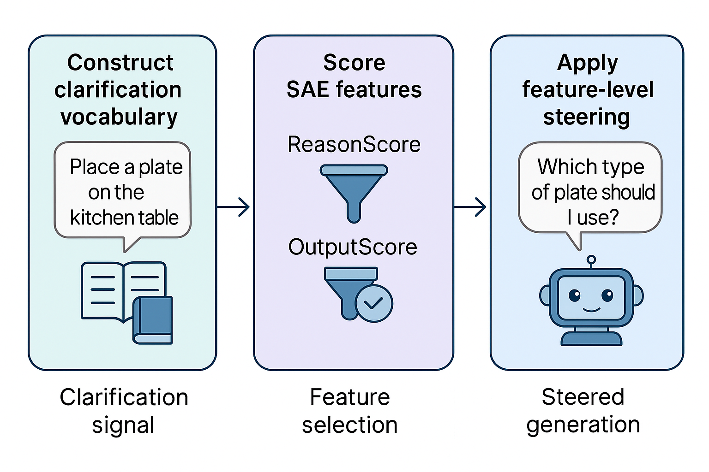

# Interpretable Steering for Clarification Behavior in LLMs

This repository is the **main experimental hub** accompanying the paper on interpretable steering of large language models (LLMs) for clarification behavior under ambiguity.

It unifies three previously independent codebases into a single, reproducible workflow:
- AmbiK (ambiguity resolution and clarification prompting)
- ClarQ-LLM (dialog-based clarification benchmarks)
- SAE-based steering for Gemma models

The repository provides:
- standardized experiment wrappers
- reproducible environment specifications
- unified artifact logging
- minimal, verifiable smoke tests for each subsystem

---

## Method Overview

**High-level idea:**  
We steer a local LLM (Gemma) using interpretable Sparse Autoencoder (SAE) features to control *when and how* the model asks clarification questions. The steered model is evaluated across two complementary benchmarks:

1. **AmbiK** — single-turn ambiguity resolution
2. **ClarQ-LLM** — multi-turn clarification dialogues

The provider model (Qwen) supplies information when clarification is requested, while evaluation is performed using official benchmark scripts.

---

## Repository Structure

